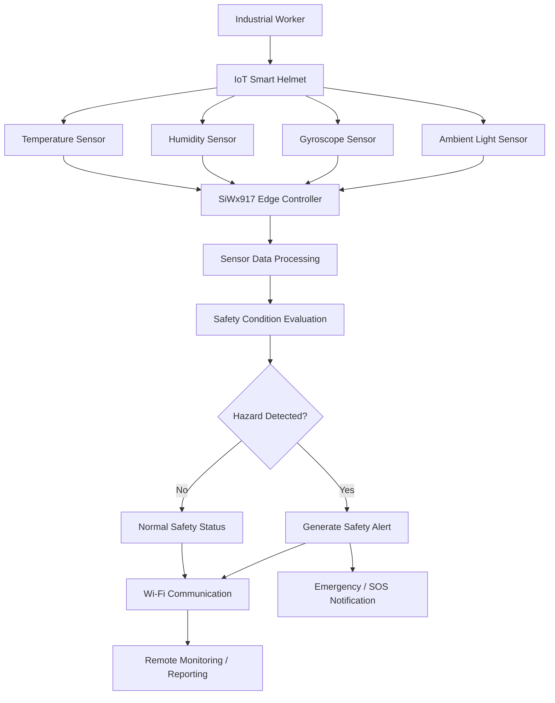
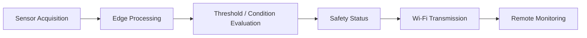

# IoT Smart Helmet — Industrial Worker Safety Monitoring

## 1. Project Overview

The **IoT Smart Helmet** is a connected industrial safety system designed to improve worker safety by continuously monitoring environmental and motion-related conditions.

The system uses the **Silicon Labs SiWx917** platform as the primary edge controller and wireless communication platform. Integrated sensors monitor temperature, humidity, movement/orientation, and ambient light conditions. The collected data is processed at the edge to identify potentially hazardous conditions such as excessive temperature, high humidity, abnormal movement, falls, and unsuitable lighting conditions.

When a safety condition is detected, the system can generate alerts and report the worker's safety status through Wi-Fi connectivity, enabling remote monitoring and faster response to hazardous situations.

### Key Objectives

* Monitor environmental conditions around industrial workers.
* Detect abnormal movement, falls, and orientation changes.
* Identify potentially unsafe temperature, humidity, and lighting conditions.
* Perform sensor processing at the edge device.
* Provide wireless connectivity for safety-status reporting.
* Support emergency/SOS-based worker safety monitoring.
* Demonstrate an Industry 4.0-oriented connected safety solution.

---

## 2. Technical Architecture

The system follows an edge-centric IoT architecture in which the helmet-mounted sensors continuously collect safety data and the SiWx917 processes the information locally before transmitting relevant status information over Wi-Fi.

### Data Flow

The SiWx917 performs the primary edge-side processing, reducing the need to continuously transmit raw sensor data and allowing safety conditions to be evaluated close to the worker.

---

## 3. Technologies Used

### Wireless Technologies

* Wi-Fi connectivity using the Silicon Labs SiWx917 platform
* Bluetooth Low Energy capability of the SiWx917 platform

### Embedded Technologies

* Embedded C
* FreeRTOS
* GPIO and peripheral interfaces
* Sensor data acquisition and processing
* Interrupt/event-based processing where applicable

### Silicon Labs Software

* Simplicity Studio 5
* WiSeConnect SDK
* Silicon Labs Simplicity SDK
* SiWx917 wireless platform software components

### Development Tools

* Silicon Labs Simplicity Studio
* Git
* GitHub
* GNU ARM toolchain

---

## 4. Hardware Components

### Silicon Labs Hardware

* **Silicon Labs SiWx917 Development Kit — BRD2605A**
* SiWx917 wireless SoC/platform
* Integrated Wi-Fi 6 and Bluetooth Low Energy capabilities

### External Hardware

#### 1. Temperature Sensor

Continuously measures ambient temperature around the worker. The measured value can be evaluated against predefined safety limits to identify high-temperature conditions.

#### 2. Humidity Sensor

Monitors the humidity level of the surrounding environment and provides data for identifying potentially uncomfortable or unsafe high-humidity conditions.

#### 3. Gyroscope Sensor

Measures angular motion and orientation changes. The sensor is used to identify abnormal movement patterns, sudden orientation changes, and potential worker fall events.

#### 4. Ambient Light Sensor

Measures surrounding light intensity and helps identify low-light or excessively bright environmental conditions that may affect worker visibility and safety.

---

## 7. Software Components / Dependencies

### Silicon Labs Dependencies

* **Simplicity Studio 5**
* **Silicon Labs Simplicity SDK — 2025.6.3**
* **Silicon Labs WiSeConnect SDK — 3.5.2**
* FreeRTOS
* SiWx917 platform software components
* GNU ARM toolchain — 12.2.1
* Silicon Labs configuration and code-generation components

### External Software Dependencies

* Git
* GitHub
* Compatible sensor drivers and peripheral interfaces required by the selected external sensors
* A web/remote monitoring interface where applicable

---

## 8. Licensing

This project is released under the **Apache License 2.0**.

The project repository contains an `LICENSE` file with the applicable license terms.

Silicon Labs SDKs, platform software, and third-party components remain subject to their respective licenses and terms. Users should refer to the corresponding SDK and component documentation for applicable third-party licensing information.

---

## 9. Maintainers / Contacts

| Name             | Role           | Contact Information                                                 | Github Profile                          |
| ---------------- | -------------- | ------------------------------------------------------------------- | --------------------------------------- |
| Arjun V          | Developer      | [arjunvasanthakumar2005@gmail.com](mailto:arjunvasanthakumar2005@gmail.com) | [Arjxn404](https://github.com/Arjxn404) |
| Harish Kumar S   | Developer      | [S-harishkumarsoffl@gmail.com](mailto:S-harishkumarsoffl@gmail.com) |                                         |
| Kavya Sri R      | Developer      | [kavyasrirdofficial@gmail.com](mailto:kavyasrirdofficial@gmail.com) |                                         |
| Samhita M        | Developer      | [samhitamanikandan@gmail.com](mailto:samhitamanikandan@gmail.com)   |                                         |
| Shree Varsha R K | Developer      | [shreevarshark@gmail.com](mailto:shreevarshark@gmail.com)           |                                         |
| Sridharshini K   | Developer      | [sdmithu24@gmail.com](mailto:sdmithu24@gmail.com)                   |                                         |
| Jaikumar R       | Faculty Mentor |                                                                     |                                         |

### Project Repository

https://github.com/Arjxn404/IoT-Smart-Helmet_ECE_KPRIET

### Institution

**KPR Institute of Engineering and Technology (KPRIET)**
Electronics and Communication Engineering
